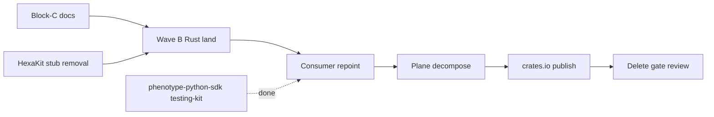

# Block-C Consolidation Plan — KooshaPari/TestingKit

**Date:** 2026-06-17  
**Status:** Approved for execution  
**Audit source:** `docs/audit/BLOCK-C-AUDIT.md`  
**Disposition:** `docs/boundary/DISPOSITION.md`  
**DAG lane:** Wave B (HexaKit testing crates) + Block-C boundary documentation

---

## Goal

Publish the **split testing boundary** for TestingKit: Python consumers default to
`phenotype-python-sdk/packages/testing-kit`; Rust fleet utilities remain canonical
here; complete Wave B HexaKit absorption; **HOLD DELETE** until registry archive
gate passes all five conditions.

This **supersedes** any implicit "delete after python-sdk copy" interpretation from
`projects/TestingKit.json` — file parity closes the Python slice only, not the Rust
boundary (`BOUNDARY_OWNERS.md`).

---

## Current baseline (verified main @ 634517a)

| Check | Result |
|-------|--------|
| Repo archived on GitHub | PASS (intentional) |
| `BOUNDARY.md` active lock | PASS |
| `docs/disposition/wave-b-absorption.md` | PASS (PR #2) |
| `docs/boundary/DISPOSITION.md` | This PR |
| Python SDK reconcile | PASS |
| Wave B bdd/contract landed in `rust/` | FAIL (pending) |
| README consumer redirect | FAIL (stale) |
| Registry delete gate (5/5) | FAIL (3/5 partial) |

---

## Phase 1 — Boundary documentation (P0)

| ID | Task | Acceptance |
|----|------|------------|
| C1.1 | Publish `docs/boundary/DISPOSITION.md` | 28-row module table |
| C1.2 | Publish `docs/audit/BLOCK-C-AUDIT.md` | Verdict = SPLIT / KEEP_ARCHIVED |
| C1.3 | Publish this consolidation plan | Execution DAG documented |
| C1.4 | Add `STATUS.md` + README redirect banner | Cross-references present |
| C1.5 | Link disposition from `BOUNDARY.md` | Single SSOT chain |

**Risk:** Low — docs only.

---

## Phase 2 — Wave B Rust absorption (P1)

| ID | Task | Acceptance |
|----|------|------------|
| C2.1 | Land `phenotype-bdd` from HexaKit | `cargo build -p phenotype-bdd` green |
| C2.2 | Land contract family (#10–#12) as a set | Workspace members + tests |
| C2.3 | Pair with HexaKit PR removing duplicate crates | disposition-index `fsm: done` |
| C2.4 | Sync phenotype-registry disposition-index ids 10–12, 41 | Registry PR |

**Owner:** TestingKit PR #1 (`feat/import-phenotype-bdd`) + HexaKit wave-B removal.

---

## Phase 3 — Consumer repoint (P2)

| ID | Task | Acceptance |
|----|------|------------|
| C3.1 | README: Python → SDK install path; Rust → git dep / future crates.io | No "empty submodule" claim |
| C3.2 | Add redirect headers on `python/*` README stubs | Point to SDK path |
| C3.3 | Fleet manifest scan: no new `TestingKit/python` imports | grep clean |
| C3.4 | Document Rust git dependency pattern in SDK testing-kit mirror | Parity doc |

---

## Phase 4 — Testing plane decomposition (P2–P3)

| ID | Task | Acceptance |
|----|------|------------|
| C4.1 | Move journey manifests + `journey-gate.yml` intent to phenotype-journeys | Gate runs at journey owner |
| C4.2 | Delete `docs/operations/iconography/` (unused SVGs) | No fleet references |
| C4.3 | Evaluate xDD split to phenoXddLib post-Wave-B | ADR or registry row |
| C4.4 | Slim aspirational ADRs + root markdown zoo | ponytail PR |

---

## Phase 5 — Archive gate re-evaluation (P4–P5)

| ID | Task | Acceptance |
|----|------|------------|
| C5.1 | Publish Rust crates to crates.io | Manifest repoint off git URL |
| C5.2 | Re-run registry 5-condition delete gate | All PASS |
| C5.3 | Decision: remain archived with redirect **or** unarchive as Rust-only | Document in registry |

**Default:** Remain **KEEP_ARCHIVED** with active Rust boundary unless fleet needs unarchive for branch protection / CI.

---

## Parallel dependencies

---

## Related documents

- [`docs/boundary/DISPOSITION.md`](../boundary/DISPOSITION.md)
- [`docs/disposition/wave-b-absorption.md`](../disposition/wave-b-absorption.md)
- [HexaKit DISPOSITION rows #4, #10–#12, #40–#41](https://github.com/KooshaPari/HexaKit/blob/main/docs/boundary/DISPOSITION.md)
- [phenotype-registry BOUNDARY_OWNERS §Testing](https://github.com/KooshaPari/phenotype-registry/blob/main/BOUNDARY_OWNERS.md)
